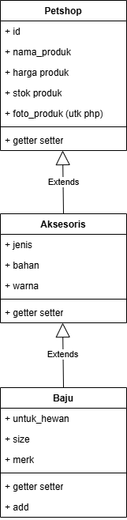

Saya Natasha Adinda Cantika dengan NIM 2312120 mengerjakan TP2 dalam mata kuliah DPBO untuk keberkahanNya maka saya tidak melakukan kecurangan seperti yang telah dispesifikasikan. Aamiin

## Diagram

  

## Penjelasan Alur

### Pada CPP, Java, dan Python:
- Class parent dan grandparent menggunakan variabel `protected` supaya variabel bisa diturunkan.
- Class cucu (`Baju`) menggunakan variabel `private`, sehingga variabel tidak dapat diakses di luar kelas.
- Metode `add` dilakukan dengan memanfaatkan constructor berparameter, user memasukkan input "add" terlebih dahulu sebelum memasukkan data input.
- Metode `show` dibuat di class `Baju`, user hanya perlu memasukkan input "show" maka tabel berisi data akan muncul.
- Untuk keluar dari program user bisa menginput "out".

### Pada PHP:
- Susunan class dan isinya sama seperti pada CPP, Java, dan Python.
- PHP tidak bisa menerima inputan dari user.

## Screenshot Output

### CPP

  

### Java

  

### Python

  

